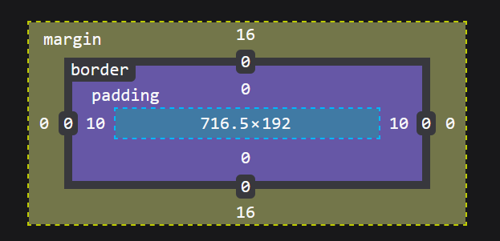

<h1>CSS basics</h1>

<h2>Text</h2>

```css
font-size:x.px;

font-weight:bold / normal / number 100 to 900 in 100 increments;

text-decoration:underline / overline / line-through;

text-align: left / center / right;
```

<h2>Box model</h2>

Count from the innermost layer
1) content
2) padding
3) border (often invisible)
4) margin (distance to other objects, transparent)



<h2>Colour</h2>

```css
color: foreground colour;
background-color: background colour;
```

Background colour is applied anywhere within the border.

Can use colour name, rgb or hex code

<h2>Margin</h2>

`margin` (covers all sides)

`margin-left` / `top` / `right` / `bottom`

use px

<h2>Border</h2>

```css
border: 1px solid red
```

equivalent to
```css
border-width:1px;
border-style:solid;
border-color:red;
```

must be in this order

<h2> Allowed units </h2>

* em
* px
* pt
* cm
* in

You must put down units

<h2> Overwriting </h2>

If you define something multiple times, it wll just go by the latest one. It's like setting a variable multiple times - the newest value holds.

<h2> Display </h2>

```css
display: block; /* will change line automatically */
display: inline; /* will not change line */
display: none; /* remove all styling */
```

Default as block:
```html
<div>
<table>
<form>
<h1> to <h5>
```
Default inline:
```html
<span>
<a>

<b>
<u>
<i>
```

<h2> Positioning </h2>

```css
position: static; /* default */
position: absolute; /* stays in the same position within its block, even if the display changes. set at least 1 of top, bottom, left, right */
position: fixed; /* stays in the same position relative to your screen, moving the display moves it so it appears in the same position (e.g. bottom right) */
```

<h2> Background images </h2>

```css
background-repeat: repeat / no-repeat / repeat-x / repeat-y;

background-attachment: scroll / fixed;
```

Can be done as a oneliner
```css
background: red url("bg.png") repeat-x scroll top left
```
allowing the combination of colour and image. the top and left are the position to align it to.

> Whilst PNG allow for transparency, they also have larger file size and load longer. It's preferred to use file formats with compression, such as JPG.
